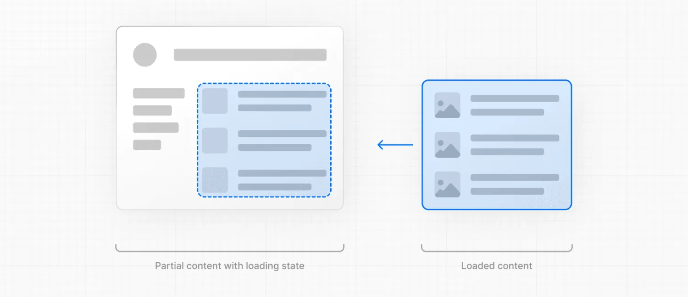

+++
date = '2024-09-16T20:16:09+08:00'
draft = false
title = 'Next.js: 如何获取数据和流'
categories = ["框架"]
tags = ["JavaScript", "Next.js"]
+++

本文将引导您了解如何在 [Server Components](https://nextjs.org/docs/app/getting-started/fetching-data#server-components) 和 [Client Components](https://nextjs.org/docs/app/getting-started/fetching-data#client-components) 中获取数据。以及如何[流式传输](https://nextjs.org/docs/app/getting-started/fetching-data#streaming)依赖于数据的内容。

## [获取数据](https://nextjs.org/docs/app/getting-started/fetching-data#fetching-data)

### [服务器组件](https://nextjs.org/docs/app/getting-started/fetching-data#server-components)

您可以使用以下方法在 Server Components 中获取数据：

1. [fetch API](https://nextjs.org/docs/app/getting-started/fetching-data#with-the-fetch-api)
2. [ORM 或数据库](https://nextjs.org/docs/app/getting-started/fetching-data#with-an-orm-or-database)

#### [使用fetch API](https://nextjs.org/docs/app/getting-started/fetching-data#with-the-fetch-api)

要使用 `fetch` API 获取数据，请将您的组件转换为异步函数，并等待 `fetch` 调用。例如：

```jsx
export default async function Page() {
  const data = await fetch('https://api.vercel.app/blog')
  const posts = await data.json()
  return (
    <ul>
      {posts.map((post) => (
        <li key={post.id}>{post.title}</li>
      ))}
    </ul>
  )
}
```

#### [使用 ORM 或数据库](https://nextjs.org/docs/app/getting-started/fetching-data#with-an-orm-or-database)

您可以通过将组件转换为异步函数并等待调用来使用 ORM 或数据库获取数据：

```jsx
import { db, posts } from '@/lib/db'
 
export default async function Page() {
  const allPosts = await db.select().from(posts)
  return (
    <ul>
      {allPosts.map((post) => (
        <li key={post.id}>{post.title}</li>
      ))}
    </ul>
  )
}
```

### [客户端组件](https://nextjs.org/docs/app/getting-started/fetching-data#client-components)

有两种方法可以在 Client Components 中获取数据，使用：

1. React 的 [use钩子](https://react.dev/reference/react/use)
2. 像 SWR 这样的社区库 或 React Query

#### [使用use钩子](https://nextjs.org/docs/app/getting-started/fetching-data#with-the-use-hook)

你可以使用 React 的 use hook 将数据从服务器流式传输到客户端。首先在你的 Server 组件中获取数据，并将 promise 作为 prop 传递给你的 Client 组件：

```jsx
import Posts from '@/app/ui/posts
import { Suspense } from 'react'
 
export default function Page() {
  // Don't await the data fetching function
  const posts = getPosts()
 
  return (
    <Suspense fallback={<div>Loading...</div>}>
      <Posts posts={posts} />
    </Suspense>
  )
}
```

然后，在你的 Client Component 中，使用 `use` 钩子读取 promise：

```jsx
'use client'
import { use } from 'react'
 
export default function Posts({
  posts,
}: {
  posts: Promise<{ id: string; title: string }[]>
}) {
  const allPosts = use(posts)
 
  return (
    <ul>
      {allPosts.map((post) => (
        <li key={post.id}>{post.title}</li>
      ))}
    </ul>
  )
}
```

在上面的示例中，您需要将组件包裹在边界中 .这意味着在解决 Promise 时将显示回退。详细了解流式传输。

#### 社区库

您可以使用像 SWR 这样的社区库 或 React Query 在 Client Components 中获取数据。这些库有自己的缓存、流式处理和其他功能的语义。例如，使用 SWR：

```jsx
'use client'
import useSWR from 'swr'
 
const fetcher = (url) => fetch(url).then((r) => r.json())
 
export default function BlogPage() {
  const { data, error, isLoading } = useSWR(
    'https://api.vercel.app/blog',
    fetcher
  )
 
  if (isLoading) return <div>Loading...</div>
  if (error) return <div>Error: {error.message}</div>
 
  return (
    <ul>
      {data.map((post: { id: string; title: string }) => (
        <li key={post.id}>{post.title}</li>
      ))}
    </ul>
  )
}
```

## [Streaming](https://nextjs.org/docs/app/getting-started/fetching-data#streaming)

**警告：** 以下内容假定在您的应用程序中启用了 [dynamicIOconfig 选项](https://nextjs.org/docs/app/api-reference/config/next-config-js/dynamicIO)。该标志是在 Next.js 15 Canary 中引入的。

在 Server Components 中使用 `async/await` 时，Next.js 将选择动态**渲染**。这意味着对于每个用户请求，数据都将在服务器上获取和呈现。如果有任何慢数据请求，则整个路由将被阻止渲染。

为了改善初始加载时间和用户体验，您可以使用流式处理将页面的 HTML 分解为较小的块，并逐步将这些块从服务器发送到客户端。


有两种方法可以在应用程序中实现流式处理：

1. 使用 [loading.js文件](https://nextjs.org/docs/app/getting-started/fetching-data#with-loadingjs)
2. 使用 React 的 [[<Suspense>组件](https://nextjs.org/docs/app/getting-started/fetching-data#with-suspense)

### [使用loading.js](https://nextjs.org/docs/app/getting-started/fetching-data#with-loadingjs)

您可以在与页面相同的文件夹中创建一个 `loading.js` 文件，以便在获取数据时流式传输**整个页面**。例如，要流式传输 `app/blog/page.js`，请将文件添加到 `app/blog` 文件夹中。


```jsx
export default function Loading() {
  // Define the Loading UI here
  return <div>Loading...</div>
}
```

在导航时，用户将立即看到页面呈现时的布局和[加载状态](https://nextjs.org/docs/app/getting-started/fetching-data#creating-meaningful-loading-states)。渲染完成后，新内容将自动换入。



在后台，`loading.js`将嵌套在 `layout.js` 中，并将自动将 `page.js` 文件和下面的任何子项包装在 `<Suspense>` 边界中。

这种方法适用于路由段（布局和页面），但对于更精细的流式处理，您可以使用 `<Suspense>`。

### [使用<](https://nextjs.org/docs/app/getting-started/fetching-data#with-suspense)[Suspense>](https://nextjs.org/docs/app/getting-started/fetching-data#with-suspense)

`<Suspense>` 允许您更精细地了解要流式传输页面的哪些部分。例如，您可以立即显示超出 `<Suspense>` 边界的任何页面内容，并在边界内的博客文章列表中流式传输。


```jsx
import { Suspense } from 'react'
import BlogList from '@/components/BlogList'
import BlogListSkeleton from '@/components/BlogListSkeleton'
 
export default function BlogPage() {
  return (
    <div>
      {/* This content will be sent to the client immediately */}
      <header>
        <h1>Welcome to the Blog</h1>
        <p>Read the latest posts below.</p>
      </header>
      <main>
        {/* Any content wrapped in a <Suspense> boundary will be streamed */}
        <Suspense fallback={<BlogListSkeleton />}>
          <BlogList />
        </Suspense>
      </main>
    </div>
  )
}
```

### [创建有意义的加载状态](https://nextjs.org/docs/app/getting-started/fetching-data#creating-meaningful-loading-states)

即时加载状态是在导航后立即向用户显示的回退 UI。为了获得最佳用户体验，我们建议设计有意义的加载状态，并帮助用户了解应用正在响应。例如，您可以使用骨架和微调器，或者将来屏幕中很小但有意义的部分，例如封面照片、标题等。

在开发过程中，你可以使用 React Devtools 预览和检查组件的加载状态。