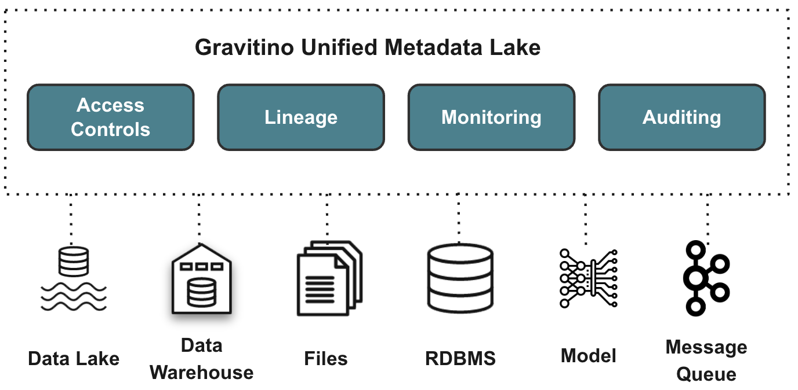
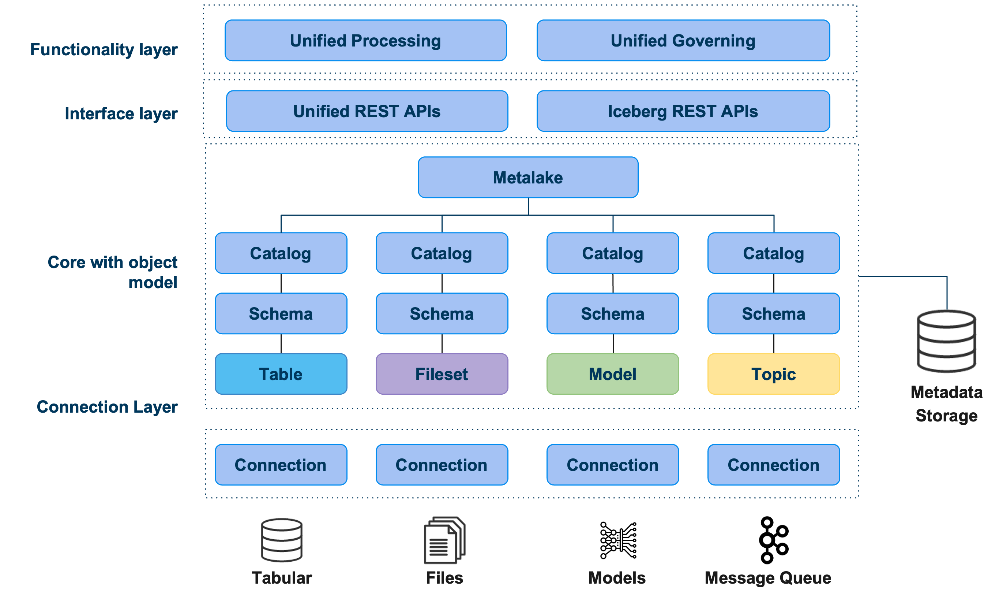

+++
date = '2024-12-15T22:10:09+08:00'
draft = false
title = 'Gravitino概述'
categories = ["数据治理"]
tags = ["JavaScript", "Next.js", "Java", "Python"]
+++

## 介绍
Apache Gravitino 是一个高性能、地理分布式和联合元数据湖。它直接在不同的来源、类型和区域中管理元数据。它还为用户提供了数据和 AI 资产的统一元数据访问。

Gravitino 旨在提供几个关键功能：
- SSOT（单一事实来源），适用于多区域数据，支持地理分布式架构。
- 为用户和引擎提供统一的数据 + AI 资产管理。
- 安全集中在一个位置，集中不同来源的安全性。
- 内置数据管理 + 数据访问管理。
## 架构

- **功能层**：Gravitino 为用户提供了一个 API 来管理和治理元数据，包括标准元数据创建、更新和删除操作。同时，它还提供了以统一方式管理元数据的能力，包括访问控制、发现等。
- **接口层**：Gravitino 为用户提供了标准的 REST API 作为接口层。未来的支持包括 Thrift 和 JDBC 接口。
- **核心对象模型**：Gravitino 定义了一个通用元数据模型，用于表示不同来源和类型的元数据，并以统一的方式管理它们。
- **连接层**：在连接层中，Gravitino 提供了一组连接器来连接到不同的元数据源，包括 Apache Hive、MySQL、PostgreSQL 等。它还允许连接和管理表格数据以外的异构元数据。
## 特征
### 统一的元数据管理和治理
Gravitino 为不同类型的元数据源抽象化了统一的元数据模型和 API。例如，表格数据的关系元数据模型，如 Hive、MySQL、PostgreSQL 等。所有非结构化数据（如 HDFS、S3 等）的文件元数据模型。
除了统一的元数据模型，Gravitino 还提供了一个统一的元数据治理层，以统一的方式管理元数据，包括访问控制、审计、发现等。
### 直接元数据管理
与需要从底层系统主动或被动收集元数据的传统元数据管理系统不同，Gravitino 直接管理这些系统。它提供了一组连接器来连接到不同的元数据源。Gravitino 的变化直接反映在底层系统中，反之亦然。
### 地理分布支持
Gravitino 支持地理分布部署，这意味着不同的 Gravitino 实例可以部署在不同的区域或云中，并且它们可以连接以相互获取元数据。这样，用户可以获得跨区域或云的元数据的全局视图。
### 多引擎支持
Gravitino 支持不同的查询引擎来访问元数据。目前支持 Trino，用户可以使用 Trino 查询元数据和数据，而无需更改现有的 SQL 方言。
与此同时，其他查询引擎支持正在制定路线图中，包括 Apache Spark、Apache Flink 等。
### AI 资产管理
Gravitino 的目标是统一数据和 AI 资产（包括原始文件、模型等）中的数据管理。
## 术语
### Apache Gravitino 的元数据对象
- **Metalake**：元数据的容器/租户。通常，一个组有一个 metalake 来管理其中的所有元数据。每个 metalake 都公开一个三级命名空间 （catalog.schema. table） 来组织数据。
- **目录**：目录是来自特定元数据源的元数据集合。每个目录都有一个相关的连接器，用于连接到特定的元数据源。
- **Schema**：Schema 是对元数据集合进行分组的第二级命名空间，schema 可以引用关系元数据源中的数据库/schema，例如 Apache Hive、MySQL、PostgreSQL 等。Schema 还可以引用文件集和模型目录的 logic 名称空间。
- **表**：支持关系元数据源的目录的对象层次结构中的最低级别。您可以在目录中的特定架构中创建 Table。
- **文件集**：文件集元数据对象是指文件系统中文件和目录的集合。文件集元数据对象用于管理文件的逻辑元数据。
- **模型**：模型元数据对象表示支持模型管理的特定目录中的元数据。
- **主题**：主题元数据对象表示支持管理消息队列系统（如 Kafka）的主题的特定目录中的元数据。