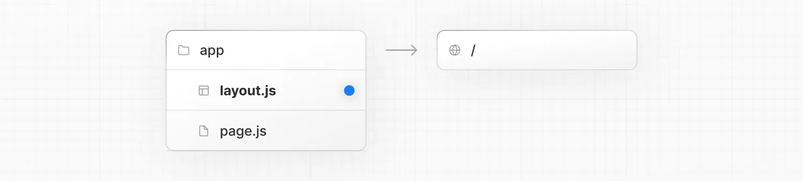
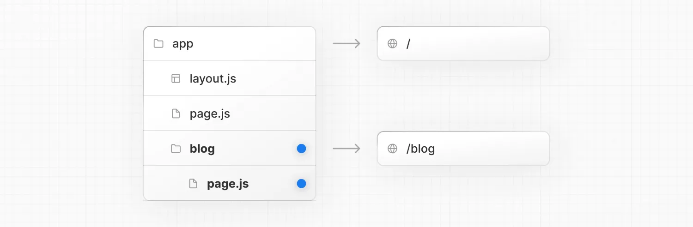
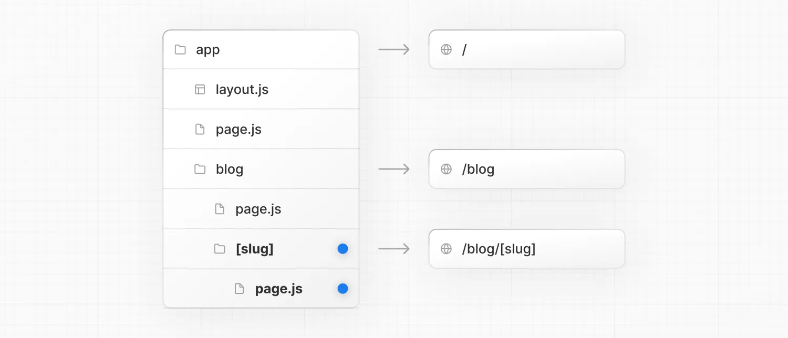
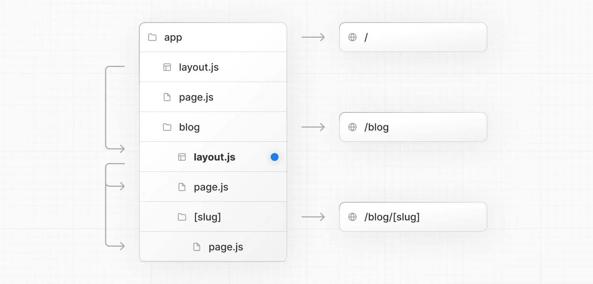

+++
date = '2024-09-15T19:18:09+08:00'
draft = false
title = 'Next.js: 如何创建布局和页面'
categories = ["框架"]
tags = ["JavaScript", "Next.js"]
+++

Next.js 使用基于文件系统的路由，这意味着您可以使用文件夹和文件来定义路由。本页将指导您如何创建布局和页面，以及它们之间的链接。
## [创建页面](https://nextjs.org/docs/app/getting-started/layouts-and-pages#creating-a-page)
页面是特定路由上渲染的 UI。要创建页面，在 `app` 目录内添加一个 `page` 文件，并默认导出一个 React 组件。例如，要创建索引页面（ `/` ）：


```jsx
export default function Page() {
  return <h1>Hello Next.js!</h1>
}
```
## [创建布局](https://nextjs.org/docs/app/getting-started/layouts-and-pages#creating-a-layout)
布局是多个页面之间共享的 UI。在导航时，布局保持状态，保持交互性，并且不会重新渲染。
您可以通过默认导出一个 React 组件自 `layout` 文件来定义布局。该组件应接受一个 `children` 属性，该属性可以是页面或另一个布局。
例如，要创建一个接受您的索引页面作为子页面的布局，请在 `app` 目录内添加一个 `layout` 文件：


```jsx
export default function DashboardLayout({
  children,
}: {
  children: React.ReactNode
}) {
  return (
    <html lang="en">
      <body>
        {/* Layout UI */}
        {/* Place children where you want to render a page or nested layout */}
        <main>{children}</main>
      </body>
    </html>
  )
}
```

上述布局称为根布局，因为它定义在 `app` 目录的根目录下。根布局是必需的，并且必须包含 `html` 和 `body` 标签。

## [创建嵌套路由](https://nextjs.org/docs/app/getting-started/layouts-and-pages#creating-a-nested-route)

嵌套路由是由多个 URL 段组成的路由。例如， `/blog/[slug]` 路由由三个段组成：

- `/` （根段）
- `blog` （段）
- `[slug]` （叶段）

在 Next.js：

- 文件夹用于定义映射到 URL 段的路由段。
- 文件（如 `page` 和 `layout` ）用于创建显示在某个段落的 UI。

创建嵌套路由，您可以在每个文件夹内部嵌套其他文件夹。例如，要添加对 `/blog` 的路由，在 `app` 目录中创建一个名为 `blog` 的文件夹。然后，为了使 `/blog` 公开可访问，添加一个 `page` 文件：



```jsx
import { getPosts } from '@/lib/posts'
import { Post } from '@/ui/post'
 
export default async function Page() {
  const posts = await getPosts()
 
  return (
    <ul>
      {posts.map((post) => (
        <Post key={post.id} post={post} />
      ))}
    </ul>
  )
}
```

您可以继续嵌套文件夹以创建嵌套路由。例如，要为特定博客文章创建路由，在 `blog` 内创建一个新的 `[slug]` 文件夹，并添加一个 `page` 文件：



```jsx
function generateStaticParams() {}
 
export default function Page() {
  return <h1>Hello, Blog Post Page!</h1>
}
```

## [嵌套布局](https://nextjs.org/docs/app/getting-started/layouts-and-pages#nesting-layouts)

默认情况下，文件夹层次结构中的布局也是嵌套的，这意味着它们通过其 `children` 属性包装子布局。您可以通过在特定路由段（文件夹）内添加 `layout` 来嵌套布局。

例如，要为 `/blog` 路由创建布局，请在 `blog` 文件夹内添加一个新的 `layout` 文件。



```jsx
export default function BlogLayout({
  children,
}: {
  children: React.ReactNode
}) {
  return <section>{children}</section>
}
```

如果您将上述两个布局合并，根布局（ `app/layout.js` ）将包裹博客布局（ `app/blog/layout.js` ），该布局将包裹博客（ `app/blog/page.js` ）和博客文章页面（ `app/blog/[slug]/page.js` ）。

## [页面链接](https://nextjs.org/docs/app/getting-started/layouts-and-pages#linking-between-pages)

您可以使用 `<Link>` 组件在路由之间导航。 `<Link>` 是 Next.js 的一个内置组件，它扩展了 HTML `<a>` 标签以提供预加载和客户端导航。

例如，要生成博客文章列表，从 `next/link` 导入 `<Link>` 并将 `href` 属性传递给组件：

```jsx
import Link from 'next/link'
 
export default async function Post({ post }) {
  const posts = await getPosts()
 
  return (
    <ul>
      {posts.map((post) => (
        <li key={post.slug}>
          <Link href={`/blog/${post.slug}`}>{post.title}</Link>
        </li>
      ))}
    </ul>
  )
}
```

`<Link>` 是在您的 Next.js 应用程序中导航到不同路由的主要和推荐方式。然而，您也可以使用 `useRouter` 钩子进行更高级的导航。