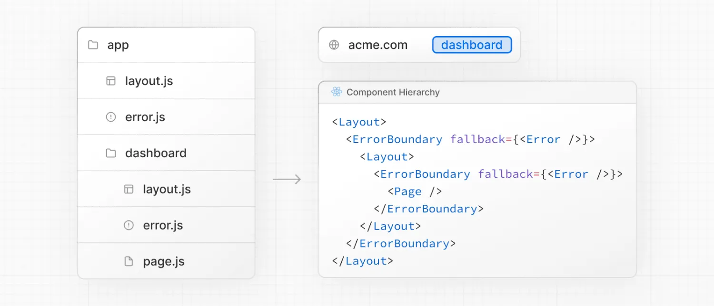

+++
date = '2024-09-20T21:13:09+08:00'
draft = false
title = 'Next.js: 如何处理错误'
categories = ["框架"]
tags = ["JavaScript", "Next.js"]
+++

错误可以分为两类：[预期错误](https://nextjs.org/docs/app/getting-started/error-handling#handling-expected-errors)[和未捕获的异常](https://nextjs.org/docs/app/getting-started/error-handling#handling-uncaught-exceptions)。本页将引导您了解如何在 Next.js 应用程序中处理这些错误。
## [处理预期错误](https://nextjs.org/docs/app/getting-started/error-handling#handling-expected-errors)

预期错误是指在应用程序正常运行期间可能发生的错误，例如来自[服务器端表单验证](https://nextjs.org/docs/app/building-your-application/data-fetching/server-actions-and-mutations#server-side-form-validation)或失败请求的错误。应显式处理这些错误并将其返回给客户端。
### [Server Actions](https://nextjs.org/docs/app/getting-started/error-handling#server-actions)

您可以使用 useActionState hook 来管理 Server Functions 的状态 并处理预期的错误。避免对预期错误使用 try/catch 块。相反，您可以将预期错误建模为返回值，而不是引发的异常。

```jsx
'use server'
 
export async function createPost(prevState: any, formData: FormData) {
  const title = formData.get('title')
  const content = formData.get('content')
 
  const res = await fetch('https://api.vercel.app/posts', {
    method: 'POST',
    body: { title, content },
  })
  const json = await res.json()
 
  if (!res.ok) {
    return { message: 'Failed to create post' }
  }
}
```

然后，您可以将 action 传递给 `useActionState` 钩子，`并使用返回的状态`来显示错误消息。

```jsx
'use client'
 
import { useActionState } from 'react'
import { createPost } from '@/app/actions'
 
const initialState = {
  message: '',
}
 
export function Form() {
  const [state, formAction, pending] = useActionState(createPost, initialState)
 
  return (
    <form action={formAction}>
      <label htmlFor="title">Title</label>
      <input type="text" id="title" name="title" required />
      <label htmlFor="content">Content</label>
      <textarea id="content" name="content" required />
      {state?.message && <p aria-live="polite">{state.message}</p>}
      <button disabled={pending}>Create Post</button>
    </form>
  )
}
```

### [服务器组件](https://nextjs.org/docs/app/getting-started/error-handling#server-components)

在 Server Component 中获取数据时，您可以使用响应有条件地呈现错误消息或[重定向](https://nextjs.org/docs/app/api-reference/functions/redirect)。

```jsx
export default async function Page() {
  const res = await fetch(`https://...`)
  const data = await res.json()
 
  if (!res.ok) {
    return 'There was an error.'
  }
 
  return '...'
}
```

### [Not found](https://nextjs.org/docs/app/getting-started/error-handling#not-found)

您可以在路由段中调用 [notFound](https://nextjs.org/docs/app/api-reference/functions/not-found) 函数，并使用 [not-found.js](https://nextjs.org/docs/app/api-reference/file-conventions/not-found) 文件来显示 404 UI。

```jsx
import { getPostBySlug } from '@/lib/posts'
 
export default async function Page({ params }: { params: { slug: string } }) {
  const post = getPostBySlug((await params).slug)
 
  if (!post) {
    notFound()
  }
 
  return <div>{post.title}</div>
}
```

```jsx
export default function NotFound() {
  return <div>404 - Page Not Found</div>
}
```

## [处理未捕获的异常](https://nextjs.org/docs/app/getting-started/error-handling#handling-uncaught-exceptions)

未捕获的异常是意外错误，表示在应用程序的正常流程中不应发生的错误或问题。这些应该通过抛出错误来处理，然后由错误边界捕获。

### [嵌套错误边界](https://nextjs.org/docs/app/getting-started/error-handling#nested-error-boundaries)

Next.js 使用错误边界来处理未捕获的异常。错误边界捕获其子组件中的错误，并显示回退 UI，而不是崩溃的组件树。

通过在 route segment 中添加 [error.js](https://nextjs.org/docs/app/api-reference/file-conventions/error) 文件并导出 React 组件来创建错误边界：

```jsx
'use client' // Error boundaries must be Client Components
 
import { useEffect } from 'react'
 
export default function Error({
  error,
  reset,
}: {
  error: Error & { digest?: string }
  reset: () => void
}) {
  useEffect(() => {
    // Log the error to an error reporting service
    console.error(error)
  }, [error])
 
  return (
    <div>
      <h2>Something went wrong!</h2>
      <button
        onClick={
          // Attempt to recover by trying to re-render the segment
          () => reset()
        }
      >
        Try again
      </button>
    </div>
  )
}
```

错误将冒泡到最近的父错误边界。这允许通过将 `error.tsx` 文件放置在[路由层次结构](https://nextjs.org/docs/app/getting-started/project-structure#component-hierarchy)中的不同级别来进行精细的错误处理。



### [全局错误](https://nextjs.org/docs/app/getting-started/error-handling#global-errors)

虽然不太常见，但您可以使用位于根 app 目录中的 [global-error.js](https://nextjs.org/docs/app/api-reference/file-conventions/error#global-error) 文件处理根布局中的错误，即使在利用[国际化](https://nextjs.org/docs/app/building-your-application/routing/internationalization)时也是如此。全局错误 UI 必须定义自己的 `<html>` 和 `<body>` 标记，因为它在活动时会替换根布局或模板。

```jsx
'use client' // Error boundaries must be Client Components
 
export default function GlobalError({
  error,
  reset,
}: {
  error: Error & { digest?: string }
  reset: () => void
}) {
  return (
    // global-error must include html and body tags
    <html>
      <body>
        <h2>Something went wrong!</h2>
        <button onClick={() => reset()}>Try again</button>
      </body>
    </html>
  )
}
```