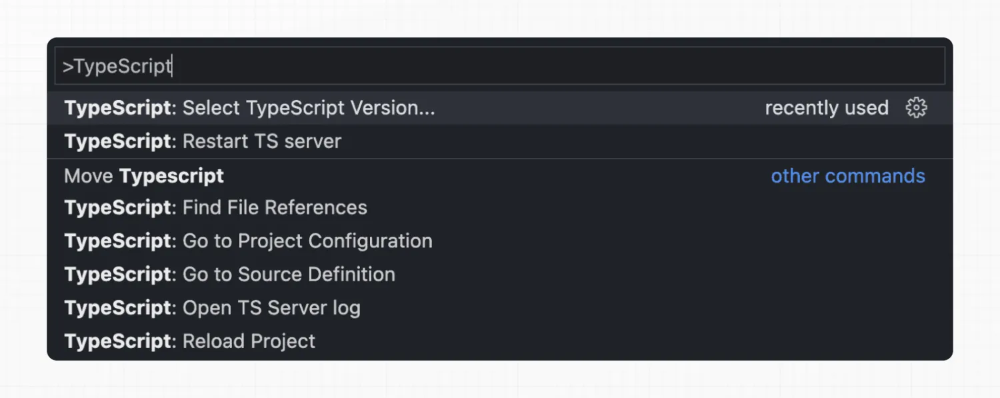

+++
date = '2024-09-14T21:44:09+08:00'
draft = false
title = 'Next.js: 如何设置新的项目'
categories = ["框架"]
tags = ["JavaScript", "Next.js"]
+++
## [系统](https://nextjs.org/docs/app/getting-started/installation#system-requirements)要求

- Node.js 18.18 或更高版本。
- macOS、Windows（包括 WSL）和 Linux 均受支持。

## [自动安装](https://nextjs.org/docs/app/getting-started/installation#automatic-installation)

我们建议使用 `create-next-app` 开始一个新的 Next.js 应用，它将自动为您设置一切。要创建项目，请运行：

```shell
npx create-next-app@latest
```

安装时，您将看到以下提示：

```
What is your project named? my-app
Would you like to use TypeScript? No / Yes
Would you like to use ESLint? No / Yes
Would you like to use Tailwind CSS? No / Yes
Would you like your code inside a `src/` directory? No / Yes
Would you like to use App Router? (recommended) No / Yes
Would you like to use Turbopack for `next dev`?  No / Yes
Would you like to customize the import alias (`@/*` by default)? No / Yes
What import alias would you like configured? @/*
```

在提示后， `create-next-app` 将创建一个以您的项目名称命名的文件夹并安装所需的依赖项。
## [手动安装](https://nextjs.org/docs/app/getting-started/installation#manual-installation)

手动创建新的 Next.js 应用，安装所需的包：

```shell
npm install next@latest react@latest react-dom@latest
```

打开您的 `package.json` 文件，并添加以下 `scripts` ：

```json
{
  "scripts": {
    "dev": "next dev",
    "build": "next build",
    "start": "next start",
    "lint": "next lint"
  }
}
```

这些脚本涉及开发应用程序的不同阶段：

- `dev` : 运行 `next dev` 以在开发模式下启动 Next.js。
- `build` : 运行 `next build` 以构建用于生产使用的应用程序。
- `start` : 运行 `next start` 以启动 Next.js 生产服务器。
- `lint` : 运行 `next lint` 以设置 Next.js 内置 ESLint 配置。

### [创建app目录](https://nextjs.org/docs/app/getting-started/installation#create-the-app-directory)

Next.js 使用文件系统路由，这意味着您的应用程序中的路由由您如何组织文件来决定。

创建一个 `app` 文件夹，然后添加一个 `layout.tsx` 和 `page.tsx` 文件。这些文件将在用户访问您的应用程序根目录（ `/` ）时被渲染。

创建 `app/layout.tsx` 内的根布局，并使用所需的 `<html>` 和 `<body>` 标签：

```jsx
export default function RootLayout({
  children,
}: {
  children: React.ReactNode
}) {
  return (
    <html lang="en">
      <body>{children}</body>
    </html>
    )
}
```

最后，创建一个主页 `app/page.tsx` 并添加一些初始内容：

```jsx
export default function Page() {
  return <h1>Hello, Next.js!</h1>
}
```

如果您忘记创建 `layout.tsx` ，Next.js 将在运行开发服务器时自动创建此文件 。

您可以选择在项目根目录下使用一个 `src` 目录来将您的应用程序代码与配置文件分开。

### [创建public文件夹（可选）](https://nextjs.org/docs/app/getting-started/installation#create-the-public-folder-optional)

您可以选择在项目的根目录下创建一个 `public` 文件夹来存储静态资源，如图片、字体等。然后，您可以从基本 URL（ `/` ）开始通过您的代码引用 `public` 内的文件。

## [运行开发服务器](https://nextjs.org/docs/app/getting-started/installation#run-the-development-server)

1. 运行 `npm run dev` 启动开发服务器。
2. 访问 `http://localhost:3000` 查看您的申请。
3. 编辑 `app/page.tsx` 文件并保存，以在浏览器中查看更新后的结果。

## [设置 TypeScript](https://nextjs.org/docs/app/getting-started/installation#set-up-typescript)

Next.js 自带 TypeScript 支持。要将 TypeScript 添加到您的项目中，将文件重命名为 `.ts` / `.tsx` 。运行 `next dev` ，Next.js 将自动安装必要的依赖并添加一个包含推荐配置选项的 `tsconfig.json` 文件。

### [IDE 插件](https://nextjs.org/docs/app/getting-started/installation#ide-plugin)

Next.js 包含一个自定义的 TypeScript 插件和类型检查器，VSCode 和其他代码编辑器可以使用它进行高级类型检查和自动完成。

您可以通过以下方式在 VS Code 中启用插件：

1. 打开命令面板（ `Ctrl/⌘` + `Shift` + `P` ）
2. 搜索 "TypeScript: 选择 TypeScript 版本"
3. 选择“使用工作区版本”



现在，在编辑文件时，将启用自定义插件。当运行 `next build` 时，将使用自定义类型检查器。

查看 TypeScript 配置页面以获取有关如何在项目中使用 TypeScript 的更多信息。

## [设置 ESLint](https://nextjs.org/docs/app/getting-started/installation#set-up-eslint)

Next.js 自带内置 ESLint，在您使用 `create-next-app` 创建新项目时，会自动安装必要的包并配置适当的设置。

将 ESLint 添加到现有项目中，将 `next lint` 作为脚本添加到 `package.json` :

```json
{
  "scripts": {
    "lint": "next lint"
  }
}
```

然后，运行 `npm run lint` ，您将进入安装和配置过程。

```shell
pnpm lint
```

您将看到一个类似这样的提示：

您希望如何配置 ESLint？

❯ Strict (recommended) 严格（推荐）  
Base 基础  
Cancel 取消

- **严格**：包含 Next.js 的基础 ESLint 配置以及更严格的 Core Web Vitals 规则集。这是为首次设置 ESLint 的开发者推荐配置。
- **基础**：包括 Next.js 的基础 ESLint 配置。
- 不包括任何 ESLint 配置。仅当您计划设置自己的自定义 ESLint 配置时才选择此选项。

如果选择了这两个配置选项中的任何一个，Next.js 将自动将 `eslint` 和 `eslint-config-next` 作为依赖项安装到您的应用程序中，并在项目根目录中创建一个包含您所选配置的 `.eslintrc.json` 文件。

您现在每次想要运行 ESLint 捕获错误时都可以运行 `next lint` 。一旦 ESLint 设置完成，它也会在每次构建时自动运行（ `next build` ）。错误会导致构建失败，而警告则不会。

查看 ESLint 插件页面以获取有关如何在项目中配置 ESLint 的更多信息。

## [设置绝对导入和模块路径别名](https://nextjs.org/docs/app/getting-started/installation#set-up-absolute-imports-and-module-path-aliases)

Next.js 内置了对 `tsconfig.json` 和 `jsconfig.json` 文件中的 `"paths"` 和 `"baseUrl"` 选项的支持。这些选项允许您将项目目录别名设置为绝对路径，从而更容易导入模块。例如：

```jsx
// Before
import { Button } from '../../../components/button'

// After
import { Button } from '@/components/button'
```

配置绝对导入，请将 `baseUrl` 配置选项添加到您的 `tsconfig.json` 或 `jsconfig.json` 文件中。例如：

```json
{
  "compilerOptions": {
    "baseUrl": "src/"
  }
}
```

除了配置 `baseUrl` 路径外，您还可以使用 `"paths"` 选项来指定 `"alias"` 模块路径。

例如，以下配置将 `@/components/*` 映射到 `components/*` ：

```json
{
  "compilerOptions": {
    "baseUrl": "src/",
    "paths": {
      "@/styles/*": ["styles/*"],
      "@/components/*": ["components/*"]
    }
  }
}
```

每个 `"paths"` 都与 `baseUrl` 位置相关。例如：

```typescript
import Button from '@/components/button'
import '@/styles/styles.css'

export default function HomePage() {
  return (
    <div>
    <h1>Hello World</h1>
    <Button />
    </div>
  )
}
```